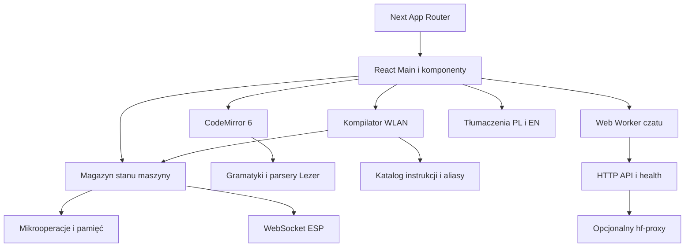

# Audyt migracji Maszyny W do Next.js

Stan badania: 11 września 2026. Wersja odniesienia: commit `b60e1549ce95a08b89bb960925e5b60581a37c85`. Źródłami są kod aplikacji, pierwotny i aktualny `package.json`, oba pliki blokad npm, testy oraz wyniki uruchomienia aplikacji. Raport opisuje decyzje migracyjne; dokładne wersje wszystkich zależności przechodnich pozostają zapisane w `package-lock.json` i `hf-proxy/package-lock.json`.

## Architektura i granice migracji

Pierwotna aplikacja była pojedynczą stroną Vue 3 uruchamianą przez Vite. `Main.vue` łączył interfejs, stan maszyny, zapis ustawień, wykonanie programu i komunikację WebSocket. Edytory używały bezpośrednio CodeMirror 6. Kompilator WLAN, definicje instrukcji i katalog laboratoriów były modułami JavaScript/TypeScript niezależnymi od Vue.

Nowa aplikacja używa Next.js App Router i prawdziwych komponentów React. Nie uruchamia instancji Vue wewnątrz Next.js. `src/app/layout.jsx` odpowiada za dokument HTML, metadane i wspólne style; `page.jsx` za trasę `/`; `Simulator.jsx` ładuje interaktywny symulator w przeglądarce. Wyłączenie SSR dla symulatora wynika z jego zależności od edytora, pamięci lokalnej, canvas, Web Workera i WebSocket. Strona posiada stan ładowania i granicę błędów.

Stan wykonania przeniesiono do `src/state/`: dane początkowe, selektory, metody maszyny i magazyn obserwowany przez `useSyncExternalStore`. Zapewnia to jeden aktualny stan dla opóźnionych mikrooperacji, asynchronicznego wykonania i zdarzeń sprzętu. Zagnieżdżone tablice oraz zbiory breakpointów wywołują aktualizacje React; natywne obiekty sieciowe zachowują tożsamość. Rejestry, instrukcje i protokół sprzętowy zachowują dotychczasowe nazwy.



## Wszystkie pierwotne zależności bezpośrednie

„Wersja obecna” oznacza wersję rozwiązaną w pliku blokady, a nie tylko zakres dopuszczony w manifeście. Kolumna decyzji dotyczy deklaracji bezpośredniej; usunięta deklaracja nie zawsze oznacza zniknięcie pakietu z całego grafu.

| Pakiet | Pierwotny zakres | Decyzja i wersja obecna | Powód / miejsce użycia |
| --- | --- | --- | --- |
| `@codemirror/autocomplete` | `^6.12.0` | Zachowany, `6.18.6` | Podpowiedzi poleceń, aliasy językowe i obsługa nawiasów w edytorze. |
| `@codemirror/commands` | `^6.3.3` | Zachowany, `6.8.1` | Historia, undo/redo, wcięcia i skróty klawiaturowe. |
| `@codemirror/lang-javascript` | `^6.2.1` | Zachowany, `6.2.4` | Dotychczasowy język zapasowy komponentu edytora. |
| `@codemirror/language` | `^6.10.0` | Zachowany, `6.11.2` | `LanguageSupport`, dopasowanie nawiasów i kolorowanie składni. |
| `@codemirror/lint` | `^6.5.0` | Usunięta deklaracja bezpośrednia | Brak bezpośredniego importu w aplikacji. Pakiet nadal występuje przechodnio przez `@codemirror/lang-javascript`. Diagnostyka kompilatora WLAN jest osobnym mechanizmem. |
| `@codemirror/search` | `^6.5.5` | Zachowany, `6.5.11` | Wyszukiwanie i podświetlanie zaznaczonych dopasowań. |
| `@codemirror/state` | `^6.4.0` | Zachowany, `6.5.2` | Dokument, transakcje, tryb tylko do odczytu i rekonfiguracja rozszerzeń. |
| `@codemirror/theme-one-dark` | `^6.1.2` | Usunięty | Brak użycia; strona ma własne motywy `mwTheme` i `macroTheme`. |
| `@codemirror/view` | `^6.23.0` | Zachowany, `6.38.0` | Bezpośrednie tworzenie i sprzątanie `EditorView`, gutter, dekoracje i zawijanie wierszy. |
| `@lezer/generator` | `^1.7.0` | Zachowany tylko jako narzędzie deweloperskie, `1.8.0` | Pierwotnie zadeklarowany jednocześnie w `dependencies` i `devDependencies`. Generuje parsery obu języków podczas budowania. |
| `@lezer/highlight` | `^1.2.0` | Zachowany, `1.2.1` | Tagi składni wykorzystywane przez własne języki i motywy. |
| `@lezer/lr` | `^1.4.0` | Zachowany, `1.4.2` | Środowisko wykonawcze wygenerowanych parserów. |
| `codemirror` | `^6.0.1` | Usunięty | Dotychczas użyty tylko do importu `EditorView`; bezpośredni import pochodzi teraz z `@codemirror/view`. |
| `netlify` | `^21.5.0` | Usunięty | Brak importów SDK w aplikacji i brak poleceń wymagających go. Hosting konfiguruje `netlify.toml`. |
| `vue` | `^3.5.13` | Zastąpiony przez React | Komponenty JSX, hooki, kontekst i magazyn stanu zastąpiły komponenty SFC oraz reaktywność Vue. |
| `vue-codemirror` | `^6.1.1` | Usunięty | Nie był używany przez działający edytor; integracja CodeMirror jest bezpośrednia. |
| `vue-i18n` | `^11.2.8` | Zastąpiony lokalnym modułem i18n | Zachowano słowniki, klucze i interpolację parametrów. `useI18n` obsługuje React, a `translate` pozostaje dostępne dla kompilatora i silnika. |
| `ws` | `^8.18.2` | Zachowany i zaktualizowany, `8.21.3` | `server.cjs` używa serwera WebSocket. Kod przeglądarkowy korzysta z natywnego `WebSocket`. |
| `@vitejs/plugin-vue` | `^5.2.1` | Usunięty | Kompilację komponentów przejął Next.js; nie ma plików SFC w aktywnym grafie aplikacji. |
| `concurrently` | `^9.1.2` | Zachowany, `9.1.2` | `npm run dev:ws` uruchamia frontend i lokalny relay WebSocket. |
| `prettier` | `^3.5.3` | Zachowany, `3.5.3` | Narzędzie formatowania źródeł. |
| `sass` | `^1.87.0` | Zachowany, `1.87.0` | Aktywny arkusz `src/styles/main.scss` i jego moduły są nadal używane. |
| `typescript` | `^5.8.3` | Zachowany, `5.8.3` | Kompilator WLAN, typy, sprawdzanie projektu i wsparcie Next.js. |
| `vite` | `^6.0.5` | Zastąpiony przez Next.js | Serwer deweloperski, budowanie, zmienne publiczne i konfiguracja proxy przeniesione do Next. |
| `vite-plugin-vue-devtools` | `^7.6.8` | Usunięty | Wtyczka instrumentowała Vue i Vite; nie odpowiada nowej architekturze. |

## Nowe zależności bezpośrednie

| Pakiet | Wersja z blokady | Rola |
| --- | --- | --- |
| `next` | `16.3.4` | App Router, budowanie, serwer, eksport statyczny, metadane i opcjonalne przekierowanie API. |
| `react` | `19.3.0` | Renderowanie komponentów i cykl życia interfejsu. |
| `react-dom` | `19.3.0` | Integracja React z DOM oraz renderowanie używane w testach komponentów. |
| `@types/node` | `24.13.4` | Typy skryptów i testów Node. |
| `@types/react` | `19.3.0` | Typy React. |
| `@types/react-dom` | `19.3.0` | Typy integracji React DOM. |
| `tsx` | `4.23.13` | Uruchamianie testów TypeScript przez wbudowany runner `node:test`. |
| `@playwright/test` | `1.63.0` | Powtarzalne testy przeglądarkowe interakcji symulatora, także przy rozmiarze ekranu telefonu. |

Wymaganie głównego projektu zapisano jako Node `>=20.9.0`. Badanie wykonywano na Node `24.14.1`. `hf-proxy` jest osobnym pakietem z własnym plikiem blokady; jego deklaracja Node `>=18` pozostała odrębna.

## Graf zależności przechodnich i audyt npm

Pierwotny główny plik blokady zawierał **1484 wpisy pakietów**, obecny zawiera **164**. Są to wszystkie wpisy `packages` poza korzeniem, łącznie z opcjonalnymi wariantami platformowymi; nie jest to liczba plików bundla ani liczba paczek faktycznie instalowanych na jednej platformie. Główny manifest ma obecnie 13 zależności wykonawczych i 10 deweloperskich.

Najważniejsze grupy grafu:

| Korzeń grafu | Zależności przechodnie i znaczenie |
| --- | --- |
| Next.js | `@next/env`, `@swc/helpers`, PostCSS, `styled-jsx`, dane zgodności przeglądarek oraz opcjonalne binaria SWC i `sharp`. Warianty dla innych systemów pozostają zapisane w blokadzie. |
| React DOM | `scheduler`; zgodna wersja React jest zależnością równorzędną. |
| CodeMirror / Lezer | Współdzielone `state`, `view`, `language`, `@lezer/common`, parser JavaScript, `style-mod`, `crelt`, `w3c-keyname` i segmentacja znaków. Sprawdzono także przechodnią obecność `@codemirror/lint`. |
| Sass | `chokidar`, `immutable`, `source-map-js` i opcjonalny `@parcel/watcher`; są potrzebne do budowania i obserwacji arkuszy. |
| concurrently | `chalk`, `lodash`, `rxjs`, `shell-quote`, `supports-color`, `tree-kill`, `yargs`; używane przez lokalne polecenie uruchomienia dwóch procesów. |
| tsx | `esbuild` i jego warianty platformowe; tylko narzędzie uruchamiania testów. |
| Playwright Test | `playwright` i `playwright-core`; sterowanie przeglądarką na potrzeby testów, bez importów w aplikacji produkcyjnej. |
| Definicje typów | `undici-types` i `csstype`; nie implementują funkcji interfejsu w przeglądarce. |
| WebSocket | `ws`; opcjonalne dodatki natywne nie są bezpośrednimi zależnościami aplikacji. |

W pośrednim audycie po wymianie frameworka wykryto pięć podatnych pakietów: `immutable`, `lodash`, `picomatch`, `shell-quote` i `ws`; raport klasyfikował cztery jako wysokie i jeden jako krytyczny. Uaktualniono rozwiązywane zależności. W końcowej blokadzie występują m.in. `immutable 5.1.9`, `lodash 4.18.1`, `picomatch 2.3.2`, `shell-quote 1.10.0` oraz `ws 8.21.3`.

Końcowy audyt npm wykonany podczas migracji zwrócił **0 zgłoszonych podatności dla głównego projektu i 0 dla `hf-proxy`**. To wynik dopasowania wersji do bazy advisory w chwili wykonania; nie zastępuje badania bezpieczeństwa całego kodu ani usług zewnętrznych. Pełny graf należy odtwarzać z pliku blokady przez `npm ci`, a nie przez wybieranie nowszych wersji pojedynczych paczek bez ponownej walidacji.

Osobny pakiet `hf-proxy` zachowuje wszystkie cztery pierwotne zależności:

| Pakiet | Pierwotny zakres | Obecna wersja | Rola |
| --- | --- | --- | --- |
| `cors` | `^2.8.5` | `2.8.5` | Kontrola dopuszczonych originów, metod i nagłówków. |
| `dotenv` | `^16.4.5` | `16.6.1` | Ładowanie konfiguracji serwerowej. |
| `express` | `^4.19.2` | `4.22.2` | Endpointy `/api/chat` i `/health`. |
| `express-rate-limit` | `^7.4.0` | `7.5.1` | Ograniczenie częstotliwości żądań czatu. |

W `hf-proxy/package.json` dodano `overrides.qs = ^6.16.0`: Express `4.22.2` wskazywał `qs 6.15.3`, a aktualizacja wymagała poprawionej wersji tego pakietu przechodniego. Frontend nie importuje Express, CORS ani konfiguracji serwerowej do przeglądarki.

## Inwentarz komponentów

Pierwotne repozytorium zawierało **57 plików `.vue`**. Dla **55** istnieją komponenty `.jsx` pod tą samą ścieżką bazową. `App.vue` zastąpił układ Next.js, a nieużywany duplikat `src/components/ProgramSection.vue` został zakwalifikowany do usunięcia. Tabela poniżej stanowi kompletny wykaz.

| Plik pierwotny | Odpowiednik / decyzja |
| --- | --- |
| `src/App.vue` | `src/app/layout.jsx`, `page.jsx`, `Simulator.jsx` |
| `src/assets/svg/CommandListIcon.vue` | `src/assets/svg/CommandListIcon.jsx` |
| `src/assets/svg/CompileIcon.vue` | `src/assets/svg/CompileIcon.jsx` |
| `src/assets/svg/ConsoleIcon.vue` | `src/assets/svg/ConsoleIcon.jsx` |
| `src/assets/svg/EditIcon.vue` | `src/assets/svg/EditIcon.jsx` |
| `src/assets/svg/GitHubIcon.vue` | `src/assets/svg/GitHubIcon.jsx` |
| `src/assets/svg/KogWheelIcon.vue` | `src/assets/svg/KogWheelIcon.jsx` |
| `src/assets/svg/LinkedInIcon.vue` | `src/assets/svg/LinkedInIcon.jsx` |
| `src/assets/svg/ListLinesIcon.vue` | `src/assets/svg/ListLinesIcon.jsx` |
| `src/assets/svg/MoonIcon.vue` | `src/assets/svg/MoonIcon.jsx` |
| `src/assets/svg/NextLineIcon.vue` | `src/assets/svg/NextLineIcon.jsx` |
| `src/assets/svg/RefreshIcon.vue` | `src/assets/svg/RefreshIcon.jsx` |
| `src/assets/svg/RunIcon.vue` | `src/assets/svg/RunIcon.jsx` |
| `src/assets/svg/SunIcon.vue` | `src/assets/svg/SunIcon.jsx` |
| `src/assets/svg/polslLogoLongWhite.vue` | `src/assets/svg/polslLogoLongWhite.jsx` |
| `src/components/APRegisterSection.vue` | `src/components/APRegisterSection.jsx` |
| `src/components/AiChat.vue` | `src/components/AiChat.jsx` |
| `src/components/AiChatIcon.vue` | `src/components/AiChatIcon.jsx` |
| `src/components/AiChatTrashIcon.vue` | `src/components/AiChatTrashIcon.jsx` |
| `src/components/BusLabel.vue` | `src/components/BusLabel.jsx` |
| `src/components/BusSignal.vue` | `src/components/BusSignal.jsx` |
| `src/components/CalcSection.vue` | `src/components/CalcSection.jsx` |
| `src/components/CodeMirrorEditor.vue` | `src/components/CodeMirrorEditor.jsx` |
| `src/components/CommandList.vue` | `src/components/CommandList.jsx` |
| `src/components/Console/Console.vue` | `src/components/Console/Console.jsx` |
| `src/components/Console/ConsoleDock.vue` | `src/components/Console/ConsoleDock.jsx` |
| `src/components/CounterComponent.vue` | `src/components/CounterComponent.jsx` |
| `src/components/GRegisterSection.vue` | `src/components/GRegisterSection.jsx` |
| `src/components/InstructionsEditor/ProgramSection.vue` | `src/components/InstructionsEditor/ProgramSection.jsx` |
| `src/components/Main.vue` | `src/components/Main.jsx` |
| `src/components/MaszynaW.vue` | `src/components/MaszynaW.jsx` |
| `src/components/MemoryContent.vue` | `src/components/MemoryContent.jsx` |
| `src/components/MemorySection.vue` | `src/components/MemorySection.jsx` |
| `src/components/MicroInstructionsEdtior/ExecutionControls.vue` | `src/components/MicroInstructionsEdtior/ExecutionControls.jsx` |
| `src/components/MicroInstructionsEdtior/IOPanel.vue` | `src/components/MicroInstructionsEdtior/IOPanel.jsx` |
| `src/components/MicroInstructionsEdtior/ProgramEditor.vue` | `src/components/MicroInstructionsEdtior/ProgramEditor.jsx` |
| `src/components/MobileMemoryHeader.vue` | `src/components/MobileMemoryHeader.jsx` |
| `src/components/ProgramSection.vue` | Nieu?ywany duplikat; funkcj? realizuje `src/components/InstructionsEditor/ProgramSection.jsx` |
| `src/components/RBRegisterSection.vue` | `src/components/RBRegisterSection.jsx` |
| `src/components/RMRegisterSection.vue` | `src/components/RMRegisterSection.jsx` |
| `src/components/RPRegisterSection.vue` | `src/components/RPRegisterSection.jsx` |
| `src/components/RZRegisterSection.vue` | `src/components/RZRegisterSection.jsx` |
| `src/components/RegisterComponent.vue` | `src/components/RegisterComponent.jsx` |
| `src/components/RegisterISection.vue` | `src/components/RegisterISection.jsx` |
| `src/components/SegmentedToggle.vue` | `src/components/SegmentedToggle.jsx` |
| `src/components/Settings/ColorPicker.vue` | `src/components/Settings/ColorPicker.jsx` |
| `src/components/Settings/ColorPickerPopup.vue` | `src/components/Settings/ColorPickerPopup.jsx` |
| `src/components/Settings/CreatorsPanel.vue` | `src/components/Settings/CreatorsPanel.jsx` |
| `src/components/Settings/LabCatalogDialog.vue` | `src/components/Settings/LabCatalogDialog.jsx` |
| `src/components/Settings/PeopleSection.vue` | `src/components/Settings/PeopleSection.jsx` |
| `src/components/Settings/SettingsOverlay.vue` | `src/components/Settings/SettingsOverlay.jsx` |
| `src/components/Settings/SettingsPanel.vue` | `src/components/Settings/SettingsPanel.jsx` |
| `src/components/SignalButton.vue` | `src/components/SignalButton.jsx` |
| `src/components/UI/TopBar.vue` | `src/components/UI/TopBar.jsx` |
| `src/components/WSRegisterSection.vue` | `src/components/WSRegisterSection.jsx` |
| `src/components/XRegisterSection.vue` | `src/components/XRegisterSection.jsx` |
| `src/components/YRegisterSection.vue` | `src/components/YRegisterSection.jsx` |

Duplikat `src/components/ProgramSection.vue` nie był importowany przez żaden aktywny komponent: `Main.vue` importował `./InstructionsEditor/ProgramSection.vue`. Starszy duplikat nie zawierał obserwowania zmiany programu, które posiadała wersja używana przy ładowaniu laboratoriów. Usunięcie nie odbiera działającej funkcji; implementacją docelową jest `InstructionsEditor/ProgramSection.jsx`.

## Zgodność funkcji i zmiany wynikające z migracji

| Obszar | Zachowana funkcja i realizacja |
| --- | --- |
| Schemat maszyny | Rejestry, magistrale, sygnały, edycja wartości, formaty dziesiętny/szesnastkowy/binarny, liczby ze znakiem oraz widoczność modułów. |
| Wykonanie | Tryb ręczny i programowy, kompilacja mikroinstrukcji, pojedynczy krok, wykonanie z opóźnieniem, szybkie wykonanie, STOP, reset i breakpointy. |
| Assembler | WLAN, etykiety, aliasy PL/EN, instrukcje katalogowe, skoki, `ORG`, `DATA`, `RST`, `RPA`, inicjalizacja pamięci i diagnostyka z lokalizacją. |
| Edytory | Te same gramatyki i motywy, numeracja, zawijanie, podpowiedzi, undo/redo, wyszukiwanie, komentarze, poszerzenie panelu i blokada edycji skompilowanego programu. Instancje CodeMirror są niszczone przy demontażu. |
| Lista rozkazów | Wybór, edycja kodu, zmiana nazwy, dodawanie, usuwanie, limit wynikający z liczby bitów, import `.lst`/`.json` i eksport JSON. |
| Konsola | Licznik, poziomy i kolory logów, czas wpisu, rozwijanie szczegółów błędów, przewijanie, czyszczenie i zwijanie panelu. |
| Ustawienia | Motyw, język, szerokości pól, opóźnienia, dodatkowe rejestry, grupy I/O/stosu/przerwań, automatyczny reset przy kompilacji i ustawienie podpowiedzi. Zachowano klucz pamięci lokalnej `W`. |
| Laboratoria | Zachowano `src/utils/data/labs.js`, opis i wybór laboratorium oraz ładowanie jego programu. |
| ESP | Platforma, status i ponawianie połączenia, sygnały i pamięć przez WebSocket, wybór kolorów i jasności, wysyłanie zmian kolorów. |
| Czat | Historia, sesja, klucz API użytkownika, bramka klucza, propozycje, reset, kopiowanie bloków kodu, szerokość panelu, health/wake i anulowanie. Web Worker otrzymuje konfigurację endpointów od komponentu. |
| Lokalizacja | Zachowane słowniki PL/EN i klucze błędów. Kod poza React używa funkcji `translate`; komponenty subskrybują zmianę języka. |

Podczas przepisywania usunięto również rozpoznane błędy:

- Wybranie innego rozkazu w trakcie edycji nie zapisuje treści do niewłaściwego rozkazu. Kopia pełnego katalogu pozostaje aktualna po zmianach i zmianie limitu bitów.
- Nawigacja strzałkami w przełączniku segmentowym operuje na przyciskach tego przełącznika, zamiast wyszukiwać przyciski wszystkich przełączników na stronie.
- Blokada edycji CodeMirror obejmuje stan dokumentu oraz własny skrót komentarza; skróty nie powinny modyfikować skompilowanego programu.
- Silnik zachowuje postęp po pierwszej fazie, obsługuje STOP, wznowienie breakpointu i anulowanie starego wykonania bez zatrzymywania nowego. Testy sprawdzają również wybór gałęzi warunkowej i wymianę połączenia WebSocket.
- Worker czatu nie importuje modułu i18n zależnego od React. Obsługuje JSON, tekst i strumień SSE, dzielone zdarzenia oraz znaki UTF-8; anulowanie przerywa żądanie. Historia nie powiela bieżącego pytania, a surowa treść błędnej odpowiedzi upstreamu nie jest wyświetlana.
- Proxy HF zachowuje endpointy i format wiadomości, sprawdza format wejścia i adres upstreamu, obejmuje limitem czasu także odczyt całego body i nie przekazuje użytkownikowi surowych treści błędów upstreamu. Wyodrębnienie `createProxyApp` umożliwia test z lokalnym backendem zastępczym.

Eksperymentalne `stickyCompletion.ts` nie było aktywne przed migracją: import i rozszerzenie były zakomentowane. Nie należy traktować jego braku w aktywnym edytorze jako utraty dostępnej funkcji.

## Style, obrazy i pozostałe zasoby

Aktywnym punktem wejścia stylów zarówno przed migracją, jak i po niej pozostaje `src/styles/main.scss`. Zachowano zmienne motywu, reset, typografię, układ, style maszyny, przycisków, konsoli, czatu i ustawień. Lokalne style komponentów SFC wyodrębniono do `src/styles/migrated/`, importowanego przez `index.css`. Odpowiednie atrybuty `data-*` utrzymują ograniczenie zasięgu selektorów i nie wymagają Vue w czasie działania.

`src/assets/style/base.css`, `settings.css`, `style.css` i `vars.css` nie były importowane przez aktywny punkt wejścia oryginalnej strony. Są starszym zestawem arkuszy, a nie brakującymi zależnościami nowego układu. Zapisany w nieużywanym `style.css` import Google Fonts nie był częścią aktywnego ładowania strony.

Metadane Next.js zachowują ikony i manifest z `public/`: favicon PNG/SVG/ICO, Apple Touch Icon i `site.webmanifest` wraz z ikonami aplikacji. Komponenty ikon SVG zostały przepisane do JSX z zachowaniem wektorowych kształtów. Starsze kopie obrazów w `src/assets/img/` oraz `src/assets/svg/logo-ps-white.svg` nie miały aktywnych importów w pierwotnym interfejsie. Nie zastąpiono istniejących ikon obrazami generowanymi ani zewnętrzną biblioteką.

## Środowiska, hosting i integracje

| Dotychczasowy element | Odpowiednik / decyzja |
| --- | --- |
| `index.html`, `src/main.js`, `src/App.vue` | Dokument i punkt wejścia w `src/app/`; metadane przeniesione do `layout.jsx`. |
| `vite.config.js` | `next.config.mjs`; alias `@/*` jest zapisany w `tsconfig.json`. |
| `VITE_APP_PLATFORM` | `NEXT_PUBLIC_APP_PLATFORM`; tryb ESP ustawia `scripts/next.mjs`. |
| `VITE_API_URL` | `NEXT_PUBLIC_API_URL`; worker otrzymuje URL w wiadomości startowej. |
| Health backendu | `NEXT_PUBLIC_HEALTH_URL` albo adres `/health` wyprowadzony z adresu czatu. |
| Stały adres WebSocket | `NEXT_PUBLIC_WS_URL`, z lokalnym domyślnym `ws://localhost:8080`. |
| Vite proxy `/api` | Opcjonalny `API_PROXY_TARGET` w serwerze Next; domyślnie zachowuje `/api`. `API_PROXY_STRIP_PREFIX=1` służy starszemu upstreamowi z `/chat`. `/health` trafia do `/health` backendu. |
| `VITE_TUNNEL` / `VITE_TUNNEL_HOST` | Dawne opcje Vite HMR nie sterują Next.js. Tunel i jego WebSocket należy konfigurować dla faktycznego serwera Next oraz infrastruktury proxy. |
| `vite build` i katalog `dist/` | `npm run build` tworzy `.next/`; serwowanie przez `npm start`. |
| Hosting statyczny | `npm run build:static` tworzy `out/`; Next używa standardowego katalogu roboczego `.next/`. Po eksporcie przed uruchomieniem `npm start` trzeba ponownie wykonać build serwerowy. |
| Netlify | `netlify.toml`: `npm run build:static`, publikacja `out`. Instalacja pakietu SDK `netlify` nie jest potrzebna. |
| Tryb ESP | `npm run dev:esp` / `npm run build:esp`; runner ustawia platformę i eksport statyczny. `.env.esp` nie jest automatycznie trybem środowiskowym Next.js takim jak `vite --mode esp`. |
| `server.cjs` | Zachowany lokalny relay na porcie 8080; `npm run serve:ws`, wspólnie z frontendem `npm run dev:ws`. |
| `hf-proxy` | Zachowany osobny serwer Express; `npm --prefix hf-proxy start`. Nie jest automatycznie wdrażany przez eksport statyczny frontendu. |

Eksport statyczny nie zawiera procesu Node, reguł przekazywania API ani serwera WebSocket. W takim wdrożeniu adresy publiczne czatu, health i WebSocket muszą wskazywać dostępne usługi. Zmienne `NEXT_PUBLIC_*` trafiają do kodu przeglądarki podczas budowania; nie są miejscem na sekret backendu. Konfiguracja `hf-proxy` pozostaje serwerowa: `HF_TARGET_URL`/`HF_SPACE`, `ALLOWED_ORIGINS`, `PORT` i `BODY_LIMIT_MB`.

Jednorazowe generatory migracji oraz pliki `.vue`, stary punkt wejścia i konfiguracja Vue/Vite zostały usunięte. Wersja odniesienia pozostaje w historii Git.

## Walidacja i odtworzenie badania

Końcowy przebieg `npm test` obejmował 43 testy i zakończył się bez błędów i pominięć. Zakres:

| Zestaw | Liczba | Zakres |
| --- | --- | --- |
| `tests/assembler.test.ts` | 12 | Mikroprogram DOD, etykiety i skoki, deklaracje pamięci, zakresy liczb, aliasy, własne rozkazy, dyrektywy, diagnostyka, błędna składnia, CRLF i Unicode. |
| `tests/machine.test.ts` | 10 | Mikrooperacje, wykonanie zwykłe i szybkie, breakpointy, STOP, reset, przerwania, obserwowanie/persistencja stanu, gałęzie i WebSocket. |
| `tests/chat-worker.test.ts` | 8 | Protokół API, JSON/tekst/SSE, UTF-8, anulowanie, błędy 4xx, ponowienie po wybudzeniu, brak klucza i sprzątanie strumienia przy błędzie. |
| `tests/machine-ui.test.ts` | 3 | Renderowanie schematu bez globali przeglądarkowych, parsowanie wartości i formatowanie liczb ze znakiem. |
| `tests/chat-proxy.test.ts` | 5 | Normalizacja adresów HF, rzeczywista lokalna wymiana HTTP, walidacja wejścia, ograniczenie czasu odczytu body i zgodność starszego endpointu health. |
| `tests/websocket.test.ts` | 5 | Relay z dwoma klientami, pakiety rejestrów/pamięci/LED/sygnałów/przycisków, brak echa, ping/pong, błędne wejście i konfiguracja portu/hosta. |

Przeszło `npm run typecheck`. Sprawdzanie typów nie oznacza pełnej ścisłej analizy wszystkich komponentów JSX: projekt zachowuje mieszany kod JavaScript/TypeScript. Udane budowanie produkcyjne Next.js i uruchomienie serwera potwierdziły integrację nowych modułów. Wykonano także `npm run build:esp`, który poprawnie wygenerował statyczny katalog `out/` dla platformy ESP.

Końcowy `npm run test:e2e` przeszedł 12 scenariuszy w Chrome: ręczne sygnały i rejestry, kompilacja/wykonanie DOD 0, błędy kompilatora i undo, trwałość motywu/języka/formatu/modułów, katalog ośmiu laboratoriów, mobilna pamięć, uszkodzone ustawienia, edycja/import/eksport własnych rozkazów, breakpointy, zarządzanie kluczem czatu, rzeczywisty Worker z kontrolowanym API, kopiowanie kodu, historia i anulowanie. Siedem głównych scenariuszy symulatora przeszło również na statycznym eksporcie `build:static` bez serwera Next.js.

W przeglądarce sprawdzono eksport ESP: ukrywanie czatu, ustawienia LED, ponowne otwarcie koloru z zachowaniem jasności, połączenie z lokalnym relayem i odebranie pakietów `color-update`/`mem-update` przez drugiego klienta. Windows blokował port 8080, dlatego w tym teście użyto portu 8085 i tymczasowego przekierowania adresu WebSocket w przeglądarce. Nie był to test fizycznego ESP32.

Zrzuty strony przed migracją i po niej, pełne grafy zależności oraz końcowe wyniki `npm audit` zapisano w [verification/](verification/). Obydwa audyty z 11.09.2026 wskazują zero znanych podatności. Porównano widok desktopowy; zgodność zrzutu nie zastępuje testów interakcji.

Polecenia odtwarzające sprawdzenia, uruchamiane w katalogu projektu:

```sh
npm ci
npm ci --prefix hf-proxy
npm run build:parsers
npm run typecheck
npm test
npm run build
npm start
```

Osobne warianty budowania i audyt całego grafu:

```sh
npm run build:static
npm run build:esp
npm ls --all --json
npm audit --json
npm ci --prefix hf-proxy
npm ls --all --json --prefix hf-proxy
npm audit --json --prefix hf-proxy
```

Testy przeglądarkowe wymagają zbudowanej aplikacji i dostępnej przeglądarki:

```sh
npx playwright install chromium
npm run build
npm run test:e2e
```

Konfiguracja Playwright uruchamia serwer produkcyjny automatycznie. `E2E_BASE_URL` pozwala wskazać już działający serwer, a `PLAYWRIGHT_CHANNEL` wybrać zainstalowany kanał, np. `chrome`. To zmienne procesu testowego, nie publiczna konfiguracja aplikacji.

`npm ls --all --json` odtwarza zależności wykonawcze, deweloperskie, opcjonalne i równorzędne; `npm explain NAZWA_PAKIETU` wskazuje przyczynę obecności konkretnego pakietu. Porównanie manifestu sprzed migracji można odtworzyć poleceniem `git show b60e1549ce95a08b89bb960925e5b60581a37c85:package.json`.

Granice weryfikacji: testy workera używają kontrolowanych odpowiedzi HTTP, testy proxy lokalnego backendu zastępczego, a test magazynu stanu kontrolowanego obiektu WebSocket. Nie potwierdzają dostępności zewnętrznego modelu HF ani działania konkretnego fizycznego ESP32. Udany eksport `build:esp` potwierdza budowanie plików statycznych, nie wgranie ich i działanie na fizycznej płytce. Nie przeprowadzono pełnego dowodu poprawności wszystkich kombinacji sygnałów ani analizy źródeł każdego pakietu npm; sprawdzono zastosowanie zależności, ich rozwiązywany graf i zgłoszenia bazy podatności.
